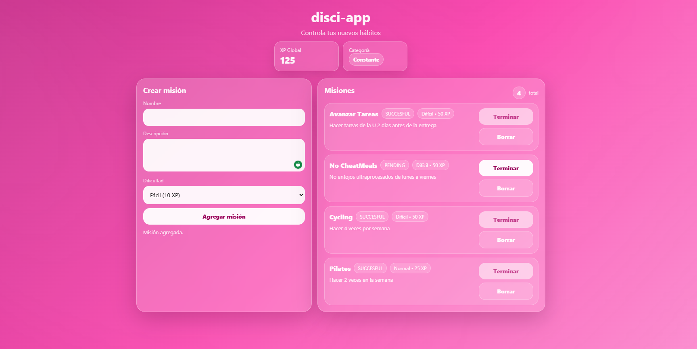
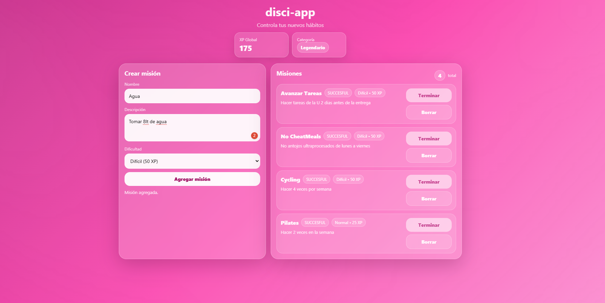

# Lab #4 — Intro to JavaScript

## Description
This lab consists of building **disci-app**, a gamification app to reinforce habits using a **missions** and **rewards (XP)** system.  
The idea is that the user creates missions (habits), completes them, and keeps accumulating global XP to level up into a higher category.

## Technologies
- HTML
- CSS
- JavaScript

## Project structure

The source code is located inside the `app/` directory:

```text
Lab-4-Intro-a-Javascript/
├── app/
│   ├── index.html
│   ├── styles.css
│   └── app.js
├── README.md
├── .gitignore
└── capturas/
    ├── 01-home.png
    ├── 02-crear-mision.png
    └── 03-succesful-xp.png
```

## Requirements

- Create each mission with: name, description, difficulty
- XP per difficulty:
  - Easy: 10 XP
  - Normal: 25 XP
  - Hard: 50 XP
- Global XP = sum of all completed missions
- 3 categories based on the user's global XP
- Show missions in a readable list
- The user can mark a mission as completed and it stays with the status **"SUCCESFUL"**

## How to run the app — Local

### Option 1: Open the HTML directly
1. Open the file `app/index.html` in any web browser.

### Option 2: Live Server — VS Code
1. Open the project folder in VS Code.
2. Right-click on `app/index.html`.
3. Select **Open with Live Server**.

## Deploying on nginx

1. Copy the content to the web folder:

```bash
sudo rm -rf /var/www/html/*
sudo cp -r app/* /var/www/html/
```

2. Restart nginx:

```bash
sudo systemctl restart nginx
```

3. Open in the browser:

```text
http://localhost
```

## Screenshots

### Main view of the application

### Normal


### Legendary


## Video
https://www.canva.com/design/DAHC3m51z1g/k-yeJrdRbjdl4cpaz5yNlw/edit?utm_content=DAHC3m51z1g&utm_campaign=designshare&utm_medium=link2&utm_source=sharebutton
